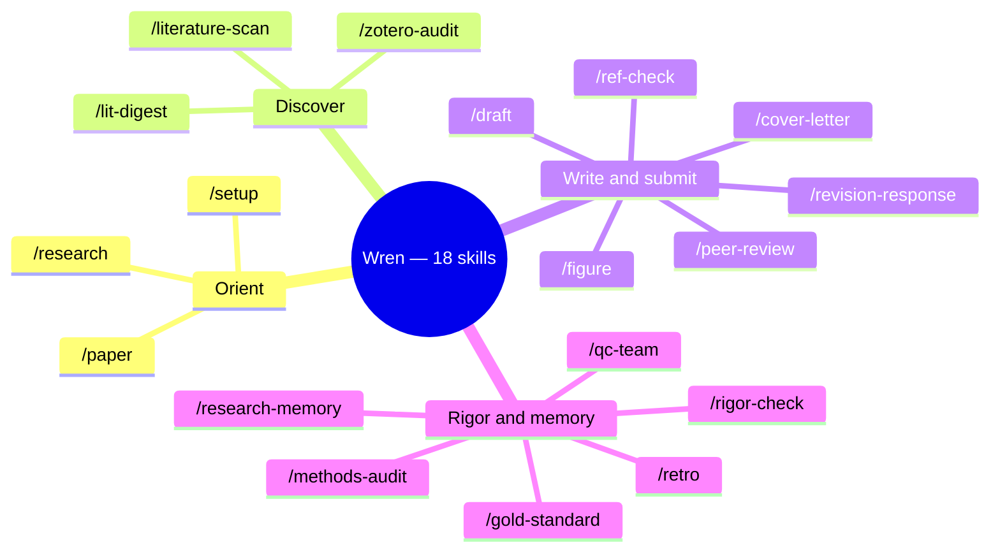

<p align="center"></p>

# Wren

[](https://www.npmjs.com/package/create-wren)
[](https://nodejs.org)
[](LICENSE)

**A research partner that remembers — from first dataset to final draft.**

Most AI tools forget your project the moment you close them. Wren doesn't. It turns [Claude Code](https://claude.com/claude-code) into a partner that knows your research, checks its own work, and helps you draft, cite, illustrate, and revise your way to a finished paper.

It runs entirely on your own machine, adds no accounts or services beyond Claude Code itself, and keeps everything it learns about your work private to you. Point it at *your* field on day one.

> Extracted and genericised from a disaster-risk-finance research system. All domain content, identity, hosting choices, and secrets have been stripped; you supply your own via one config file.


📖 **Full documentation:** <https://rchoularton.github.io/wren/>

---

## From first dataset to final draft

Every paper runs through a **14-phase pipeline** with one hard gate: **no prose until the analysis is frozen.** Phase 7 verifies your results, git-tags them, and archives them as the paper's gold standard — so a draft can never drift away from the numbers beneath it.

```mermaid
flowchart LR
    subgraph A["🔬 Analysis"]
        direction LR
        P1["1 · Scope"] --> P2["2 · Data"] --> P3["3 · Explore"] --> P4["4 · Methods"] --> P5["5 · Build"] --> P6["6 · QC · /qc-team"]
    end
    P6 --> GATE{{"🔒 Phase 7 · Freeze · /gold-standard"}}
    subgraph B["✍️ Writing"]
        direction LR
        P8["8 · Draft · /draft"] --> P9["9 · Figures · /figure"] --> P10["10 · Review"] --> P11["11 · QC draft"] --> P12["12 · Submit · /cover-letter"] --> P13["13 · Revise · /revision-response"] --> P14["14 · Publish"]
    end
    GATE --> P8
    style GATE fill:#fde68a,stroke:#b45309,stroke-width:2px,color:#000
```



## Your research toolkit

Eighteen skills — each a slash-command you type in Claude Code — grouped by the job they do. Full one-line descriptions are in [Skills](#skills) below.



---

## What you get

| | |
|---|---|
| **Four-layer memory** | Behaviour rules · cross-session context · corpus memory · per-paper deep work — each with one home and a boundary rule so nothing lands in the wrong place. |
| **Paper workflow** | A per-paper template (`STATUS`/`PLAN`/`METHODS_LOG`/`NOTES` + drafts/figures/reviews) and a build engine that round-trips Markdown ⇄ Word. A 14-phase pipeline with a **gold-standard freeze gate** (no drafting on un-frozen analysis). |
| **Self-improving loop** | `/retro` captures a learning at session end; a SessionStart hook resurfaces recent learnings; recurring feedback gets promoted into an always-on rule. |
| **Pluggable data** | Start with files (zero setup). Grow into local SQLite/DuckDB, a free self-hosted Directus (Docker, with its own MCP + admin UI), or any managed host. |
| **Pluggable references** | Universal BibTeX/CSL-JSON adapter works with *any* manager. Opt into live Zotero via MCP. Mendeley supported via `.bib` export. |
| **Ambient signals** | Long jobs post macOS notifications and log to `RUNNING.md`; degrade gracefully off macOS. |

**Beyond Claude Code itself, nothing in the core needs Zotero, a database, a scheduler, or any other account.** Those are opt-in modules you enable in one config file.

---

## Quick start (≈15 minutes)

```bash
npm create wren@latest my-research
cd my-research
# answer ~11 prompts → writes research-config.yml, renders templates, installs hooks, inits git
```

Already cloned this repo instead?

```bash
cp research-config.example.yml research-config.yml   # edit a handful of fields
./setup.sh
```

Then open the folder in Claude Code and run `/setup wren` — a guided tour that interviews you, sets up the right tools, and starts your first paper. (Prefer to jump in? Run `/paper`.) See **[QUICKSTART.md](QUICKSTART.md)** for the full first-run walkthrough, or the [Getting Started guide](https://rchoularton.github.io/wren/getting-started/).

---

## Skills

Type these in Claude Code once the project is open. All 18 ship in the box:

| | |
|---|---|
| **Orient & manage** | `/research` (workspace entry point) · `/paper` (portfolio: status, resume, start a paper) · `/setup wren` (guided onboarding) · `/setup` (reconfigure) |
| **Write & submit** | `/draft` (analysis → prose) · `/cover-letter` · `/revision-response` · `/ref-check` (validate citations) · `/peer-review` · `/figure` (figure design → critique loop) |
| **Discover** | `/literature-scan` (recent work, scooping risk, citation gaps) · `/lit-digest` (weekly cross-paper sweep → digest) · `/zotero-audit` (library hygiene) |
| **Rigor & memory** | `/gold-standard` (Phase-7 freeze) · `/qc-team` (3-agent adversarial QC) · `/rigor-check` (mid-task self-audit) · `/methods-audit` (script QC) · `/research-memory` (query/log corpus memory) · `/retro` (capture a learning) |

Some skills — like `/qc-team` and `/figure` — spin up background sub-agents to run adversarial review and figure critique loops. What's next is on the [roadmap](https://rchoularton.github.io/wren/roadmap/).

---

## Configuration

One file — `research-config.yml` — makes the kit yours: your name, a project namespace, your database backend, your reference manager, and which optional tiers to install. It is git-ignored, so your identity and paths never get committed. Secrets live only in `.env`. Re-run `./setup.sh` any time to apply edits.

See [`research-config.example.yml`](research-config.example.yml) for every field.

---

## Tiers

- **Core** (installs by default, zero external services): memory architecture, paper template + build engine, rules, hooks, notifications, the BibTeX reference adapter, the file-based data tier, and the writing/discovery skills above.
- **Corpus memory** (shipped, opt-in): a two-layer episodic + semantic memory over your literature and projects.
- **Config-selectable backends**: local/managed databases (`docs/database.md`) and reference managers including Zotero (`docs/integrations.md`).
- **Token-aware** (as of 0.7): model-routing tiers + a `npm run tokens` usage report, so cheap work runs on cheap models.
- **Scheduled jobs** (as of 0.8, opt-in): headless recurring tasks like a weekly `/lit-digest` drafted to your inbox — launchd (macOS) or cron (Linux).
- **Planned** (see [`ROADMAP.md`](ROADMAP.md)): weekly library tooling (`/librarian-team`), a second-brain memory lens, and multi-author collaboration.

Full guides on the [documentation site](https://rchoularton.github.io/wren/).

---

## Requirements

- [Claude Code](https://claude.com/claude-code) and a Claude account to run it — a Pro or Max subscription, or Anthropic API access (new to it? see [Getting Started](https://rchoularton.github.io/wren/getting-started/))
- Node ≥ 18 and Python ≥ 3.9
- macOS or Linux (scheduled jobs and desktop notifications are macOS-first; Linux uses cron and degrades notifications gracefully)
- Optional: Docker (for the local Directus database tier), a reference manager

## Contributing

Issues and PRs welcome — see [CONTRIBUTING.md](CONTRIBUTING.md). Good first contributions include porting the planned skills and adding database/reference adapters.

## License

MIT — see [LICENSE](LICENSE).
