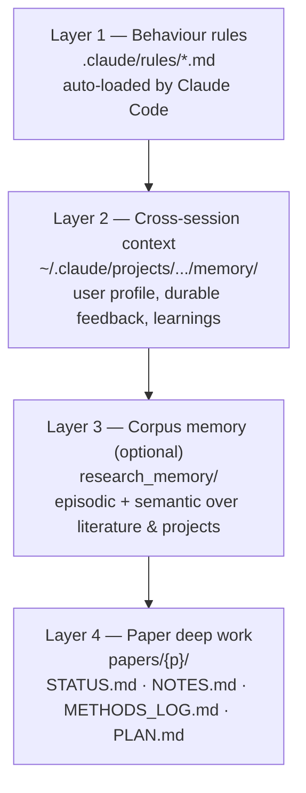
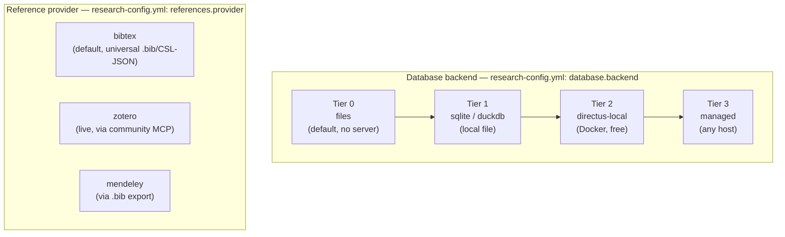

# Concepts

The kit rests on three ideas: a **four-layer memory model** so context lands in exactly one place, a **14-phase paper pipeline** gated by a gold-standard freeze, and a **pluggable backend layer** for data and references. This page explains all three.

## The four-layer memory model

Each layer has a single home and a clear trigger for what goes there. The boundary rule: **paper / project state never goes in auto-memory** — it belongs in `papers/{p}/STATUS.md` (and `research_memory/episodic/_internal/` if the corpus add-on is enabled).

| Layer | Path | Loaded by | What belongs |
|---|---|---|---|
| 1. Behaviour rules | `.claude/rules/*.md` | Claude Code, auto-loaded by `paths:` frontmatter (or always-on) | Promoted from feedback memory when a correction recurs 2+ times |
| 2. Cross-session context | `~/.claude/projects/{slug}/memory/` | Claude Code, auto-loads `MEMORY.md` (≤200 lines) at session start | User profile & preferences, durable cross-cutting feedback, dated learnings |
| 3. Corpus memory (optional add-on) | `research_memory/` | `/research-memory` skill, grep | Per-source findings (`episodic/_external/`), rolling per-artifact state (`episodic/_internal/`), synthesis (`semantic/`) |
| 4. Paper deep work | `papers/{p}/` | Read/written directly, injected each turn by a hook once `.current_paper` is set | Phase/status dashboard, long-form analytical history, methods decisions |

**The capture → index → promote loop:** `/retro` writes a dated `learning_*.md` into Layer 2; a fact gets a one-line entry in `MEMORY.md`; when a feedback memory recurs, it gets promoted into a Layer 1 rule and the original is archived.

**Boundary decision tree** — when you have something to record, ask in order:

1. A behavioural rule that should auto-fire? → Layer 1
2. About a specific paper / project? → Layer 4 (+ Layer 3 if the corpus add-on is enabled)
3. A finding from a literature source? → Layer 3 (`episodic/_external/`)
4. Cross-cutting context about the user, the project, or how to work? → Layer 2
5. A phase transition or status change? → Layer 4 (`STATUS.md`)

If it fits in two places, the deeper / more specific home wins (4 > 3 > 2 > 1).

## The 14-phase paper pipeline

Every paper moves through phases tracked in its `STATUS.md` frontmatter (`phase: N`). Phase 7 — the gold-standard freeze — is the critical gate: analysis must be verified, git-tagged, and archived as canonical **before any prose is written**. This stops drafting on numbers that later change.

```mermaid
flowchart LR
    P1[1 Scoping] --> P2[2 Data inventory] --> P3[3 Exploratory analysis] --> P4[4 Methods design] --> P5[5 Analysis build]
    P5 --> P6["6 QC review<br/>(/qc-team — planned)"]
    P6 --> P7{{"7 GOLD STANDARD FREEZE<br/>/gold-standard<br/>NO DRAFTING BEFORE THIS"}}
    P7 --> P8["8 Drafting<br/>/draft"]
    P8 --> P9["9 Figures<br/>(/figure — planned)"]
    P9 --> P10[10 Internal review] --> P11[11 QC of draft]
    P11 --> P12["12 Submission prep<br/>/cover-letter"]
    P12 --> P13["13 Peer review response<br/>/revision-response"]
    P13 --> P14[14 Publication]

    style P7 fill:#f9a825,stroke:#e65100,stroke-width:3px,color:#000
```

Shipped skills covering these phases: `/gold-standard`, `/draft`, `/cover-letter`, `/revision-response`, `/peer-review`, `/literature-scan`. `/qc-team` (phase 6) and `/figure` (phase 9) are **planned**, not shipped — until they land, run those phases manually.

Each paper lives at `papers/{id}/` with `STATUS.md`, `PLAN.md`, `METHODS_LOG.md`, `NOTES.md`, `config.json`, and `drafts/ figures/ outputs/ reviews/ gold_standard/` subfolders. Duplicate `papers/example-paper/` to start a new one. See [Papers & the build engine](guides/papers.md) for the Markdown⇄Word tooling that sits inside this pipeline.

## Pluggable backends

Nothing in the core requires a database, a reference manager, or any external account. Both the data layer and the reference layer are chosen per-project in `research-config.yml` and can be upgraded later without touching any skill or script that reads through them.

- **Database tiers** — start at `files` (Markdown/CSV/JSON, zero setup) and move up only when you need structured queries (`sqlite`/`duckdb`) or a full admin UI + API + MCP (`directus-local` via Docker, or `managed` on any host). Detail in [Databases](guides/databases.md).
- **Reference providers** — `bibtex` works with any manager and needs no external service; `zotero` opts into a live library via MCP; `mendeley` is supported today via `.bib` export (no turnkey MCP exists yet). Detail in [References & integrations](guides/references.md).

Switching tiers is a config change plus `./setup.sh` — it re-renders `.mcp.json` with the right connector blocks, it never requires rewriting the skills or scripts that consume the data.
