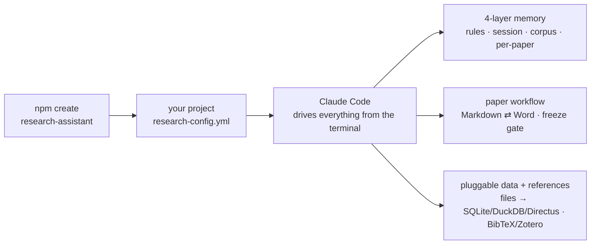

# Research Assistant Starter Kit

An agentic research assistant for [Claude Code](https://claude.com/claude-code) — the reusable scaffolding of a working PhD research system, generalised so you can point it at *your* field on day one.

It gives you a **memory that persists across sessions**, a **paper workflow** with a Markdown↔Word build engine and a gold-standard freeze gate, **behaviour rules** that keep the assistant rigorous, and a **pluggable data + reference layer** — with **no external service required** to start.

!!! note "Where this came from"
    Extracted and genericised from a disaster-risk-finance research system. All domain content, identity, hosting choices, and secrets have been stripped; you supply your own via one config file.

## How it fits together



## What you get

| | |
|---|---|
| **Four-layer memory** | Behaviour rules · cross-session context · corpus memory · per-paper deep work — each with one home and a boundary rule so nothing lands in the wrong place. See [Concepts](concepts.md). |
| **Paper workflow** | A per-paper template (`STATUS`/`PLAN`/`METHODS_LOG`/`NOTES` + drafts/figures/reviews) and a build engine that round-trips Markdown ⇄ Word. A 14-phase pipeline with a **gold-standard freeze gate** (no drafting on un-frozen analysis). See [Papers & the build engine](guides/papers.md). |
| **Self-improving loop** | `/retro` captures a learning at session end; a SessionStart hook resurfaces recent learnings; recurring feedback gets promoted into an always-on rule. |
| **Pluggable data** | Start with files (zero setup). Grow into local SQLite/DuckDB, a free self-hosted Directus (Docker, with its own MCP + admin UI), or any managed host. See [Databases](guides/databases.md). |
| **Pluggable references** | Universal BibTeX/CSL-JSON adapter works with *any* manager. Opt into live Zotero via MCP. Mendeley supported via `.bib` export. See [References & integrations](guides/references.md). |
| **Ambient signals** | Long jobs post macOS notifications and log to `RUNNING.md`; degrade gracefully off macOS. |

**Nothing in the core needs Zotero, a database, a scheduler, or any account.** Those are opt-in modules you enable in one config file.

## Quick start (≈15 minutes)

```bash
npm create research-assistant@latest my-research
cd my-research
# answer ~11 prompts → writes research-config.yml, renders templates, installs hooks, inits git
```

Then open the folder in Claude Code and run `/paper`. See [Getting Started](getting-started.md) for the full first-run walkthrough.

## Skills

All 12 shipped skills are documented on the [Skills](skills.md) page, grouped by what they do: orient & manage, write & submit, discover, and rigor & memory.

## Requirements

- [Claude Code](https://claude.com/claude-code)
- Node ≥ 18 and Python ≥ 3.9
- macOS or Linux (scheduled jobs and desktop notifications are macOS-first; Linux uses cron and degrades notifications gracefully)
- Optional: Docker (for the local Directus database tier), a reference manager

## License

MIT — see [LICENSE](https://github.com/rchoularton/create-research-assistant/blob/main/LICENSE).
